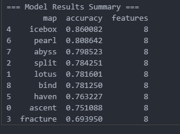

## Valorant dueling prediction model

This model was heavily inspired by the article, "Winning Fights in VALORANT: A Predictive Analytics Approach", link [here](https://cdn.prod.website-files.com/5f1af76ed86d6771ad48324b/6228f96dd382261a4887643f_Winning%20Duels%20in%20Valorant.pdf).

I used the XGBoost (Extreme Gradient Boosting) model to predict the most likely outcome of a in-game duel based on various factors such as coordinates, loadout values and time advantage. Training/testing data used is pulled from [rib.gg](rib.gg), it comprises of data from all completed VCT tournaments, such as VCT: "Masters Tokyo". That means there actually isn't a lot of data for the model to train on quite yet and causes quite a bit of extrapolation errors (e.g. the model hasn't seen many long range operator vs classic fights as it doesn't happen often in pro play, and therefore cannot tell that the weapon difference is a bigger factor than say bomb plant status), however we can easily extend the data by feeding in other events tracked by rib.gg, such as VCL or GC. Source code for data extraction is also kept in this repo.

There is a model for each map. It was best to separate them as X and Y coordinates and the corresponding positions do not correlate from map to map. These were the training results without tuning parameters just yet:

Example Usage:

This makes sense as the weapon difference and the range at which the duel was taken heavily favors the player with the stronger weaponry, as well as the fact that the bomb has been planted and the attacker is now playing in a post plant situation which is favorable.
